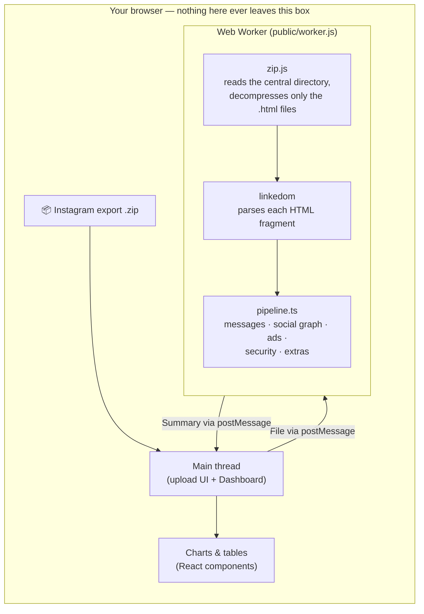

# Instagram Unwrapped

Turn your Instagram "Download your information" export into a personal
analytics dashboard — messaging patterns, top contacts, word usage over
time, social graph, ad tracking, account security, and more.

**Nothing is ever uploaded.** Your zip file is read and parsed entirely in
your browser, in a Web Worker, and the result never leaves your machine.
There is no backend and no API route in this app — it's a static site, so
you can check your browser's Network tab and see for yourself.

## How it works

1. You drop your export `.zip` (requested from Instagram in **HTML** format)
   onto the page.
2. A Web Worker opens the zip with [`@zip.js/zip.js`](https://github.com/gildas-lormeau/zip.js),
   reading only the central directory first (instant, regardless of file
   size), then decompresses just the `.html` files it needs — never the
   photos/videos, which make up most of the archive's size.
3. Each HTML fragment is parsed with [`linkedom`](https://github.com/WebReflection/linkedom)
   (a pure-JS DOM implementation — real `DOMParser` isn't available inside
   Web Workers in Chrome or Safari) using the same block/table-extraction
   rules Instagram's export template follows.
4. Everything is aggregated into one summary object and posted back to the
   page, which renders it with the same charts and layout as the original
   dashboard this project is a public port of.

## Local development

```bash
npm install
npm run dev
```

Open [http://localhost:3000](http://localhost:3000). The Web Worker is
bundled separately from the Next.js app itself (see below), so `npm run dev`
and `npm run build` both run a `predev`/`prebuild` step that rebuilds
`public/worker.js` first.

### Tests

```bash
npm test
```

Parsing logic (`lib/`) is unit-tested with [Vitest](https://vitest.dev)
against small, hand-written fixture HTML files that mirror Instagram's real
export templates — no real personal data is used in any test.

## Architecture notes



- **Why the worker is bundled separately.** Next.js/Turbopack's
  `new Worker(new URL('./worker.ts', import.meta.url))` pattern has open
  reports of asset-resolution gaps. Instead, `worker/parse.worker.ts` is
  bundled standalone via [esbuild](https://esbuild.github.io/)
  (`scripts/build-worker.mjs`) into `public/worker.js`, and instantiated
  with a plain `new Worker('/worker.js')` string — no bundler-specific
  behavior to break.
- **Why `linkedom` instead of `DOMParser`.** `DOMParser` is a `Window`-only
  API per spec; it isn't exposed inside dedicated Web Workers in Chrome or
  Safari. `linkedom` is pure JS with no native bindings, so it runs
  identically in workers, the browser main thread, and Node (which is also
  what makes the parsing logic unit-testable without a browser).
- **Static export.** `next.config.ts` sets `output: "export"` — there's no
  server-side data need anywhere in this app, so it ships as a plain static
  site.

## Tech stack

Next.js (App Router) · TypeScript · plain CSS (no Tailwind, no chart
library — every chart is hand-built inline SVG) · `@zip.js/zip.js` ·
`linkedom` · Vitest
